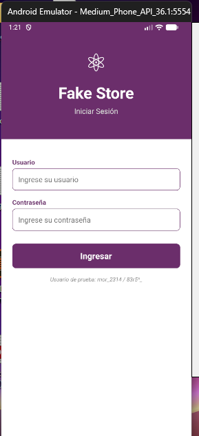
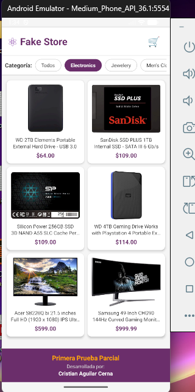
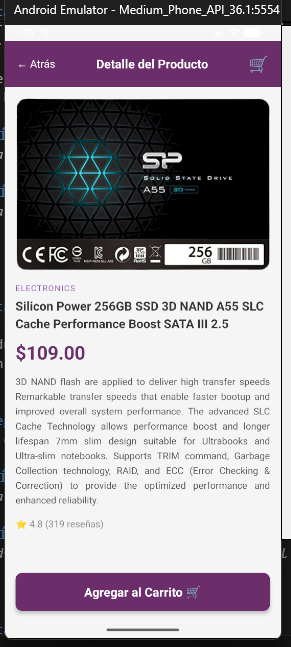
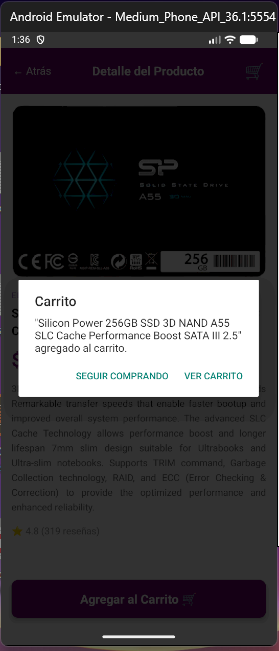
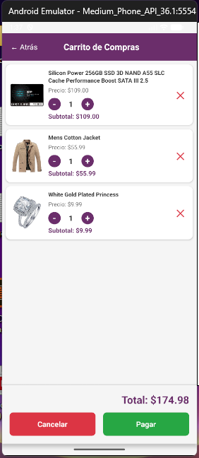
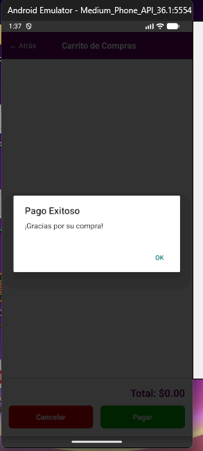

# Fake Store - Primera Prueba Parcial

Aplicación móvil desarrollada con React Native que consume el API de [FakeStore](https://fakestoreapi.com) para simular una tienda virtual. Permite autenticar usuarios, explorar productos, filtrar por categoría y gestionar un carrito de compras con persistencia local.

**Desarrollada por:** Cristian Aguilar Cerna

---

## Tecnologías utilizadas

| Tecnología | Versión | Uso |
|---|---|---|
| React Native | 0.83.0 | Framework principal |
| TypeScript | 5.8.3 | Tipado estático |
| Redux | 5.0.1 | Manejo de estado global (carrito) |
| React Redux | 9.2.0 | Conexión de Redux con componentes |
| Axios | 1.13.5 | Peticiones HTTP al API |
| React Navigation | 7.x | Navegación entre pantallas |
| NativeLocalStorage | - | Módulo nativo con SharedPreferences |

---

## Requisitos previos

- Node.js >= 20
- Android Studio con un AVD configurado (o dispositivo físico)
- JDK 17
- React Native CLI instalado globalmente

---

## Paso 1 — Crear el proyecto

Se creó el proyecto usando React Native CLI con la plantilla de TypeScript:

```bash
npx @react-native-community/cli init fakestore --template react-native-template-typescript
cd fakestore
```

Una vez creado el proyecto, se abrió el emulador de Android y se ejecutó con:

```bash
npm run android
```

---

## Paso 2 — Instalación de dependencias

Se instalaron las librerías necesarias para navegación, estado global y peticiones HTTP:

```bash
# Navegación
npm install @react-navigation/native @react-navigation/native-stack
npm install react-native-screens react-native-safe-area-context

# Redux
npm install redux react-redux

# Axios para el consumo del API
npm install axios
```

---


## Paso 3 — Módulo NativeLocalStorage

Para el almacenamiento local se implementó un módulo nativo usando **TurboModules** de React Native, que internamente usa **SharedPreferences** de Android.

Se creó la especificación en `localStorage/NativeLocalStorage.tsx`:

```typescript
import type { TurboModule } from 'react-native';
import { TurboModuleRegistry } from 'react-native';

export interface Spec extends TurboModule {
    getItem(key: string): string | null;
    setItem(key: string, value: string): void;
    removeItem(key: string): void;
    clear(): void;
}

export default TurboModuleRegistry.getEnforcing<Spec>('NativeLocalStorage');
```

Y su implementación nativa en Kotlin (`NativeLocalStorageModule.kt`) usando `SharedPreferences` para persistir datos como el token y el carrito.

---

## Paso 4 — Configuración de Redux

Se configuró el store global con un único reducer para el carrito:

**`src/components/Store.ts`**
```typescript
const ConfigureStore = () => {
    const reducers = combineReducers({ Cart: CartReducer });
    const store = legacy_createStore(reducers);
    return store;
};
```

El reducer maneja cinco acciones: `ADD_TO_CART`, `REMOVE_FROM_CART`, `UPDATE_QUANTITY`, `CLEAR_CART` y `LOAD_CART`.

---

## Paso 5 — Pantalla de Login

Se desarrolló la pantalla de autenticación que realiza una petición `POST /auth/login` con Axios al API de FakeStore. Al autenticarse correctamente, el token y el username se guardan en el localStorage nativo.



*Pantalla de inicio de sesión con campos de usuario y contraseña.*

---

## Paso 6 — Pantalla Home (pasarela de productos)

Se implementó la pantalla principal que carga el catálogo de productos desde `GET /products` y las categorías desde `GET /products/categories`. El usuario puede filtrar tocando cualquier categoría del menú horizontal.

El componente se conectó al store de Redux con `connect()` para mostrar en tiempo real la cantidad de artículos en el badge del carrito.



*Pantalla Home con la categoría Electronics seleccionada y los productos filtrados.*

---

## Paso 7 — Pantalla de Detalle del Producto

Al tocar un producto en Home, se navega a esta pantalla pasando el objeto producto por parámetros de React Navigation. Se muestra la imagen, categoría, título, precio, descripción y calificación del producto.

El botón **"Agregar al Carrito"** despacha la acción `addToCartAction` al store de Redux. Si el producto ya estaba en el carrito, el reducer incrementa su cantidad automáticamente.



*Pantalla de detalle mostrando toda la información del producto.*



*Diálogo de confirmación al agregar un producto al carrito.*

---

## Paso 8 — Pantalla del Carrito de Compras

Se implementó la pantalla del carrito que muestra:

- Imagen y nombre de cada producto
- Precio individual
- Controles `+` / `-` para ajustar la cantidad (si llega a 0 el producto se elimina)
- Subtotal por producto
- Gran total al final de la lista

Cada vez que cambia el estado de Redux, el carrito se guarda automáticamente en localStorage con `useEffect`, de modo que persiste aunque la app se cierre.



*Carrito con tres productos, subtotales y gran total.*



*Mensaje de confirmación al completar el pago.*

---

## Paso 9 — Navegación y control de sesión (App.tsx)

Se configuró el stack de navegación con React Navigation y el Provider de Redux. Al iniciar la app se verifica si existe un token guardado localmente; si existe, se restaura también el carrito guardado y se lleva al usuario directamente a Home sin pasar por Login.

---


## Usuarios de prueba

| Usuario | Contraseña |
|---|---|
| mor_2314 | 83r5^_ |
| johnd | m38rmF$ |
| kevinryan | kev02937@ |
| donero | ewedon |
| derek | jklg*_56 |
